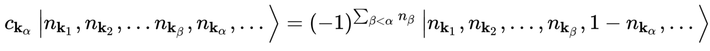

# General Notes

## Modification done:

- Commented properly programs

- Created a `utils.py` file to simplify all and avoid repetition (There were 2 instances of prob_over_time for example)

- Inverted line on creation and annihilation func, otherwise the Fermi sign was not calculated correctly cf; Wikipedia fock state page

- Renamed time_evol into time_evol_operator to avoid confusion

- Operator number too complicated for nothing: just check if 0 or 1 at the correct location

    `idx = 2 * i if spin == 'u' else 2 * i + 1
    return int(state[idx])`

- `generate_base_states`: create diagonal matrix and with np.eye: more optimized

- `time_evol`: added (hbar=1) in the parameter so that it can be modified easily

- Renamed `prob_of_state` into `transition_probability_over_time`. Used np.vdot instead of np.dot to take into account complex numbers

- Doublons between `prob_over_time` and `transition_probability_over_time`. Recoded `prob_over_time` to use the preexisting functions

- created a function `get_hubbard_states` to automatially create all the states whatever the dimension is (also have the [1,1,1,1,0,0,0,0] maybe useless, idk yet)

- created a function `hubbard_hamiltonian_matrix` to create the hamiltonian matrix once. Might take more time at the beggining to calculate but it should be faster after. (70x70 matrix for 4 sites, **only 1 sec to compute**). They both work with same matrix form but different values. Currently investigating it.

## Improvements (not sure):

## To do:

- Possibility to select the interesting curves

## Thoughts:

- Is the np.abs useful in the creation and annhilation function ?

